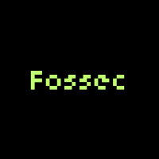

# FOSSEC – Free and Open Source Security Education Curriculum

  
*A curated, open-source cybersecurity curriculum using only free resources.*

---

## About

**FOSSEC** (Free and Open Source Security Education Curriculum) is a fully open cybersecurity learning roadmap designed for beginners and intermediate learners. Inspired by real-world job roles and industry expectations, this project curates only **high-quality, freely accessible** learning materials — including theory, labs, and certification-ready content.

There are no paywalls, no subscriptions, and no unnecessary prerequisites. Just clear guidance for anyone who wants to enter the field of cybersecurity, whether you're a student, a career switcher, or a self-learner.

---

## Curriculum Structure

The curriculum is divided into the following stages:

### 1. Cybersecurity Fundamentals

| Course | Platform | Description |
|--------|----------|-------------|
| [CS50’s Introduction to Cybersecurity](https://www.edx.org/learn/cybersecurity/harvard-university-cs50-s-introduction-to-cybersecurity) | edX (Harvard) | A general overview of security principles, threats, and real-world defenses. |
| [Cybersecurity Essentials](https://skillsforall.com/course/cybersecurity-essentials) | Cisco | A foundational course covering threats, vulnerabilities, and controls. |
| [Introduction to Cybersecurity](https://www.futurelearn.com/courses/introduction-to-cyber-security) | FutureLearn | Focuses on cyber hygiene and foundational awareness. |
| [Cyber Aces](https://www.cyberaces.org/) | SANS Institute | Covers operating systems, networking, and security basics. |

### 2. Networking & Operating Systems

| Course | Platform | Description |
|--------|----------|-------------|
| [Intro to Networking](https://skillsforall.com/course/intro-to-networks) | Cisco | Basic networking concepts and architectures. |
| [Microsoft Cybersecurity Fundamentals](https://learn.microsoft.com/en-us/training/paths/explore-cybersecurity/) | Microsoft Learn | Identity, endpoint, and cloud security concepts. |
| [Intro to Offensive Security](https://tryhackme.com/room/introtooffensivesecurity) | TryHackMe | Interactive learning on Linux, networking, and attack surfaces. |

### 3. Security Concepts & Risk Management

| Course | Platform | Description |
|--------|----------|-------------|
| [Entry-Level Cybersecurity Training](https://www.cybrary.it/course/entry-level-cybersecurity-training) | Cybrary | Introduction to common attacks, security layers, and incident response. |
| [Defensive Security and Cyber Risk](https://www.cybrary.it/course/defensive-security-and-cyber-risk) | Cybrary | Covers the NIST framework and basic risk mitigation. |

### 4. Cryptography & OSINT

| Course | Platform | Description |
|--------|----------|-------------|
| [Understanding Cryptology](http://opensecuritytraining.info/) | OpenSecurityTraining | Overview of cryptographic concepts, standards, and applications. |
| [OSINT Fundamentals](https://www.cybrary.it/course/osint-fundamentals) | Cybrary | Teaches methods for gathering open-source intelligence. |

### 5. Hands-On Labs & Practice

| Course | Platform | Description |
|--------|----------|-------------|
| [Pre-Security Path](https://tryhackme.com/path/outline/presecurity) | TryHackMe | Guided exercises on Linux, networking, and security. |
| [Complete Beginner Path](https://tryhackme.com/path/outline/complete-beginner) | TryHackMe | Step-by-step labs for ethical hacking and basic tools. |
| [Incident Response Basics](https://www.cybrary.it/course/incident-response-basics) | Cybrary | Learn how to detect, analyze, and respond to incidents. |

### 6. Malware & Threat Analysis

| Course | Platform | Description |
|--------|----------|-------------|
| [Malware Dynamic Analysis](http://opensecuritytraining.info/) | OpenSecurityTraining | Learn how malware behaves in sandbox environments. |
| [Cyber Threat Hunting](https://www.cybrary.it/course/cyber-threat-hunting/) | Cybrary | Discover threat actor behaviors and threat hunting techniques. |
| [Network Security (RITx)](https://www.edx.org/learn/network-security/rochester-institute-of-technology-network-security) | edX | Defensive strategies including firewalls, IDS, and scanning. |

---

## Additional Resources

- [PicoCTF](https://picoctf.org/) – CTFs for beginners.
- [HackTheBox (Free Labs)](https://www.hackthebox.com/) – Hands-on offensive security.
- [MIT OCW: Computer Systems Security](https://ocw.mit.edu/courses/electrical-engineering-and-computer-science/6-858-computer-systems-security-fall-2014/) – Advanced lecture series.
- [NetworkChuck](https://www.youtube.com/c/NetworkChuck) – YouTube channel on hacking, Linux, networking.
- [Professor Messer](https://www.professormesser.com/) – Free Security+ training.

---

## License

This project is licensed under the [MIT License](./LICENSE).

---

## Contributing

We welcome contributions from the community. Please read our [CONTRIBUTING.md](./CONTRIBUTING.md) for guidelines on how to contribute new courses, fix broken links, or improve the curriculum.

